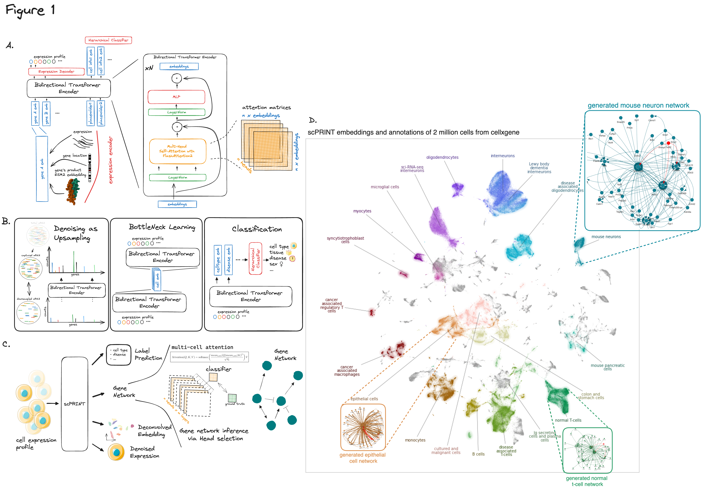

# scPRINT: Large Cell Model for scRNAseq data

[](https://badge.fury.io/py/scprint)
[](https://scprint.readthedocs.io/en/latest/?badge=latest)
[](https://pepy.tech/project/scprint)
[](https://pepy.tech/project/scprint)
[](https://pepy.tech/project/scprint)
[](https://img.shields.io/github/issues/jkobject/scPRINT)
[](https://github.com/psf/black)
[]()


scPRINT is a large transformer model built for the inference of gene networks (connections between genes explaining the cell's expression profile) from scRNAseq data.

It uses novel encoding and decoding of the cell expression profile and new pre-training methodologies to learn a cell model.

scPRINT can be used to perform the following analyses:

- __expression denoising__: increase the resolution of your scRNAseq data
- __cell embedding__: generate a low-dimensional representation of your dataset
- __label prediction__: predict the cell type, disease, sequencer, sex, and ethnicity of your cells
- __gene network inference__: generate a gene network from any cell or cell cluster in your scRNAseq dataset

[Read the paper!](https://www.biorxiv.org/content/10.1101/2024.07.29.605556v1) if you would like to know more about scPRINT.



## Install `scPRINT`

For the moment scPRINT has been tested on MacOS and Linux (Ubuntu 20.04) with Python 3.10.

If you want to be using flashattention2, know that it only supports triton 2.0 MLIR's version and torch==2.0.0 for now.

```python
conda create -n "[whatever]" python==3.10
git clone https://github.com/jkobject/scPRINT
#one of
pip install scPRINT # OR
pip install scPRINT[dev] # for the dev dependencies (building etc..) AND/OR [dev,flash]
pip install scPRINT[flash] && pip install -e "git+https:/
/github.com/triton-lang/triton.git@legacy-backend
#egg=triton&subdirectory=python" # to use flashattention2, you will need to install triton 2.0.0.dev20221202 specifically, working on removing this dependency # only if you have a compatible gpu (e.g. not available for apple GPUs for now, see https://github.com/triton-lang/triton?tab=readme-ov-file#compatibility)
```

We make use of some additional packages we developed alongside scPRint.

Please refer to their documentation for more information:

- [scDataLoader](https://github.com/jkobject/scDataLoader): a dataloader for training large cell models.
- [GRnnData](https://github.com/cantinilab/GRnnData): a package to work with gene networks from single cell data.
- [benGRN](https://github.com/jkobject/benGRN): a package to benchmark gene network inference methods from single cell data.

### lamin.ai

⚠️ if you want to use the scDataloader's multi-dataset mode or if you want to preprocess datasets and other functions of the model, you will need to use lamin.ai.

In that case, connect with google or github to [lamin.ai](https://lamin.ai/login), then be sure to connect before running anything (or before starting a notebook): `lamin login <email> --key <API-key>`. Follow the instructions on [their website](https://docs.lamin.ai/guide).

## Usage

### scPRINT's basic commands

This is the most minimal example of how scPRINT works:

```py
from lightning.pytorch import Trainer
from scprint import scPrint
from scdataloader import DataModule

datamodule = DataModule(...)
model = scPrint(...)
# to train / fit / test the model
trainer = Trainer(...)
trainer.fit(model, datamodule=datamodule)
# to do predictions Denoiser, Embedder, GNInfer
denoiser = Denoiser(...)
adata = sc.read_h5ad(...)
denoiser(model, adata=adata)
...
```

or, from a bash command line

```bash
$ scprint fit/train/predict/test/denoise/embed/gninfer --config config/[medium|large|vlarge] ...
```

find out more about the commands by running `scprint --help` or `scprint [command] --help`.

more examples of using the command line are available in the [docs](./docs/usage.md).

### Notes on GPU/CPU usage with triton

If you do not have [triton](https://triton-lang.org/main/python-api/triton.html) installed you will not be able to take advantage of GPU acceleration, but you can still use the model on the CPU.

In that case, if loading from a checkpoint that was trained with flashattention, you will need to specify `transformer="normal"` in the `load_from_checkpoint` function like so:

```python
model = scPrint.load_from_checkpoint(
    '../data/temp/last.ckpt', precpt_gene_emb=None,
    transformer="normal")
```

We now explore the different usages of scPRINT:

### I want to generate gene networks from scRNAseq data:

-> Refer to the section . gene network inference in [this notebook](./docs/notebooks/cancer_usecase.ipynb#).

-> More examples in this notebook [./notebooks/assessments/bench_omni.ipynb](./notebooks/assessments/bench_omni.ipynb).

### I want to generate cell embeddings and cell label predictions from scRNAseq data:

-> Refer to the embeddings and cell annotations section in [this notebook](./docs/notebooks/cancer_usecase.ipynb#).

### I want to denoising my scRNAseq dataset:

-> Refer to the Denoising of B-cell section in [this notebook](./docs/notebooks/cancer_usecase.ipynb).

-> More example in our benchmark notebook [./notebooks/assessments/bench_denoising.ipynb](./notebooks/assessments/bench_denoising.ipynb).

### I want to generate an atlas-level embedding

-> Refer to the notebook [nice_umap.ipynb](./figures/nice_umap.ipynb).

### I need to generate gene tokens using pLLMs

To run scPRINT, you can use the option to define the gene tokens using protein language model embeddings of genes. This is done by providing the path to a parquet file of the precomputed set of embeddings for each gene name to scPRINT via "precpt_gene_emb"

-> To generate this file please refer to the notebook [generate_gene_embeddings](docs/notebooks/generate_gene_embeddings.ipynb).

### I want to pre-train scPRINT from scratch on my own data

-> Refer to the documentation page [pretrain scprint](docs/pretrain.md)

### Documentation

For more information on usage please see the documentation in [https://www.jkobject.com/scPrint/](https://www.jkobject.com/scPrint/)

### Model Weights

Model weights are available on [hugging face](https://huggingface.co/jkobject/scPRINT/).

## Development

Read the [CONTRIBUTING.md](CONTRIBUTING.md) file.

Read the [training runs](https://wandb.ai/ml4ig/scprint_scale/reports/scPRINT-trainings--Vmlldzo4ODIxMjgx?accessToken=80metwx7b08hhourotpskdyaxiflq700xzmzymr6scvkp69agybt79l341tv68hp) document to know more about how pre-training was performed and the its behavior.

Acknowledgement:
[python template](https://github.com/rochacbruno/python-project-template)
[laminDB](https://lamin.ai/)
[lightning](https://lightning.ai/)

## Work in progress:

1. remove the triton dependencies
2. add version with additional labels (tissues, age) and organisms (mouse, zebrafish) and more datasets from cellxgene
3. version with separate transformer blocks for the encoding part of the bottleneck learning and for the cell embeddings
4. improve classifier to output uncertainties and topK predictions when unsure
5. 

Awesome Large Cell Model created by Jeremie Kalfon.
