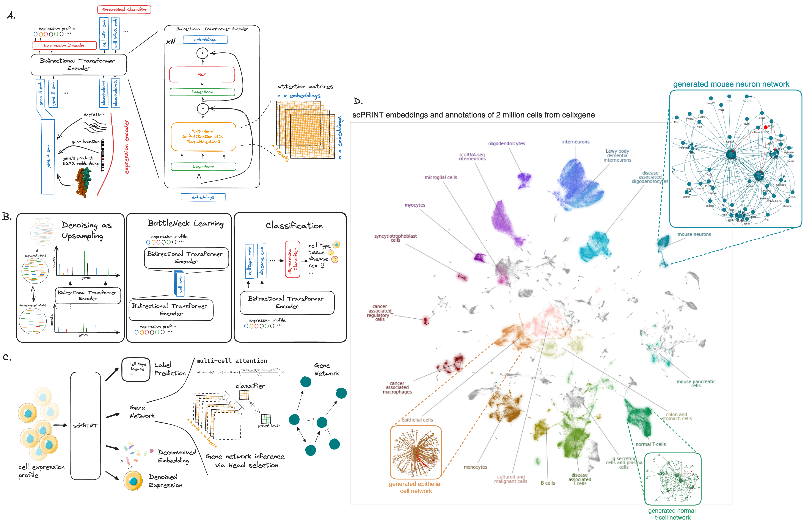

# scPRINT: Large Cell Model for scRNAseq data

[](https://codecov.io/gh/jkobject/scPRINT)
[](https://github.com/jkobject/scPRINT/actions/workflows/main.yml)
[](https://badge.fury.io/py/scprint)
[](https://pepy.tech/project/scprint)
[](https://pepy.tech/project/scprint)
[](https://pepy.tech/project/scprint)
[](https://img.shields.io/github/issues/jkobject/scPRINT)
[](https://github.com/psf/black)
[](https://doi.org/10.1101/2024.07.29.605556)


scPRINT is a large transformer model built for the inference of gene networks (connections between genes explaining the cell's expression profile) from scRNAseq data.

It uses novel encoding and decoding of the cell expression profile and new pre-training methodologies to learn a cell model.

scPRINT can be used to perform the following analyses:

- __expression denoising__: increase the resolution of your scRNAseq data
- __cell embedding__: generate a low-dimensional representation of your dataset
- __label prediction__: predict the cell type, disease, sequencer, sex, and ethnicity of your cells
- __gene network inference__: generate a gene network from any cell or cell cluster in your scRNAseq dataset

[Read the manuscript!](https://www.biorxiv.org/content/10.1101/2024.07.29.605556v1) if you would like to know more about scPRINT. Have a look at some of my [X-plainers](https://twitter.com/jkobject). 



## Table of Contents

- [scPRINT: Large Cell Model for scRNAseq data](#scprint-large-cell-model-for-scrnaseq-data)
  - [Table of Contents](#table-of-contents)
  - [Install `scPRINT`](#install-scprint)
    - [pytorch and GPUs](#pytorch-and-gpus)
    - [lamin.ai](#laminai)
  - [Usage](#usage)
    - [scPRINT's basic commands](#scprints-basic-commands)
    - [Notes on GPU/CPU usage with triton](#notes-on-gpucpu-usage-with-triton)
  - [FAQ](#faq)
    - [I want to generate gene networks from scRNAseq data:](#i-want-to-generate-gene-networks-from-scrnaseq-data)
    - [I want to generate cell embeddings and cell label predictions from scRNAseq data:](#i-want-to-generate-cell-embeddings-and-cell-label-predictions-from-scrnaseq-data)
    - [I want to denoise my scRNAseq dataset:](#i-want-to-denoise-my-scrnaseq-dataset)
    - [I want to generate an atlas-level embedding](#i-want-to-generate-an-atlas-level-embedding)
    - [I need to generate gene tokens using pLLMs](#i-need-to-generate-gene-tokens-using-pllms)
    - [I want to pre-train scPRINT from scratch on my own data](#i-want-to-pre-train-scprint-from-scratch-on-my-own-data)
    - [how can I find if scPRINT was trained on my data?](#how-can-i-find-if-scprint-was-trained-on-my-data)
    - [can I use scPRINT on other organisms rather than human?](#can-i-use-scprint-on-other-organisms-rather-than-human)
    - [how long does scPRINT takes? what kind of resources do I need? (or in alternative: can i run scPRINT locally?)](#how-long-does-scprint-takes-what-kind-of-resources-do-i-need-or-in-alternative-can-i-run-scprint-locally)
    - [I have different scRNASeq batches. Should I integrate my data before running scPRINT?](#i-have-different-scrnaseq-batches-should-i-integrate-my-data-before-running-scprint)
    - [where to find the gene embeddings?](#where-to-find-the-gene-embeddings)
  - [Documentation](#documentation)
  - [Model Weights](#model-weights)
  - [Development](#development)
  - [Work in progress (PR welcomed):](#work-in-progress-pr-welcomed)


## Install `scPRINT`

For the moment scPRINT has been tested on MacOS and Linux (Ubuntu 20.04) with Python 3.10.

If you want to be using flashattention2, know that it only supports triton 2.0 MLIR's version and torch==2.0.0 for now.

```bash
conda create -n "[whatever]" python==3.10
#one of
pip install scprint # OR
pip install scprint[dev] # for the dev dependencies (building etc..) OR
pip install scprint[flash] && pip install -e "git+https:/
/github.com/triton-lang/triton.git@legacy-backend
#egg=triton&subdirectory=python" # to use flashattention2, you will need to install triton 2.0.0.dev20221202 specifically, working on removing this dependency # only if you have a compatible gpu (e.g. not available for apple GPUs for now, see https://github.com/triton-lang/triton?tab=readme-ov-file#compatibility)
#OR pip install scPRINT[dev,flash]
```

We make use of some additional packages we developed alongside scPRint.

Please refer to their documentation for more information:

- [scDataLoader](https://github.com/jkobject/scDataLoader): a dataloader for training large cell models.
- [GRnnData](https://github.com/cantinilab/GRnnData): a package to work with gene networks from single cell data.
- [benGRN](https://github.com/jkobject/benGRN): a package to benchmark gene network inference methods from single cell data.

### pytorch and GPUs

scPRINT can run on machines without GPUs, but it will be slow. It is highly recommended to use a GPU for inference.

Once you have a GPU, and installed the required drivers, you might need to install a specific version of pytorch that is compatible with your drivers (e.g. nvidia 550 drivers will lead to a nvidia toolkit 11.7 or 11.8 which will mean you need to install pytorch 2.2.0 using the command:
`pip install torch==2.2.0 torchvision==0.17.0 torchaudio==2.2.0 --index-url https://download.pytorch.org/whl/cu118` on linux
 ).

### lamin.ai

⚠️ if you want to use the scDataloader's multi-dataset mode or if you want to preprocess datasets and other functions of the model, you will need to use lamin.ai.

In that case, connect with google or github to [lamin.ai](https://lamin.ai/login), then be sure to connect before running anything (or before starting a notebook): `lamin login <email> --key <API-key>`. Follow the instructions on [their website](https://docs.lamin.ai/guide).

## Usage

### scPRINT's basic commands

This is the most minimal example of how scPRINT works:

```py
from lightning.pytorch import Trainer
from scprint import scPrint
from scdataloader import DataModule

datamodule = DataModule(...)
model = scPrint(...)
# to train / fit / test the model
trainer = Trainer(...)
trainer.fit(model, datamodule=datamodule)
# to do predictions Denoiser, Embedder, GNInfer
denoiser = Denoiser(...)
adata = sc.read_h5ad(...)
denoiser(model, adata=adata)
...
```

or, from a bash command line

```bash
$ scprint fit/train/predict/test/denoise/embed/gninfer --config config/[medium|large|vlarge] ...
```

find out more about the commands by running `scprint --help` or `scprint [command] --help`.

more examples of using the command line are available in the [docs](./docs/usage.md).

### Notes on GPU/CPU usage with triton

If you do not have [triton](https://triton-lang.org/main/python-api/triton.html) installed you will not be able to take advantage of GPU acceleration, but you can still use the model on the CPU.

In that case, if loading from a checkpoint that was trained with flashattention, you will need to specify `transformer="normal"` in the `load_from_checkpoint` function like so:

```python
model = scPrint.load_from_checkpoint(
    '../data/temp/last.ckpt', precpt_gene_emb=None,
    transformer="normal")
```

We now explore the different usages of scPRINT:

## FAQ

### I want to generate gene networks from scRNAseq data:

-> Refer to the section . gene network inference in [this notebook](./docs/notebooks/cancer_usecase.ipynb#).

-> More examples in this notebook [./notebooks/assessments/bench_omni.ipynb](./notebooks/bench_omni.ipynb).

### I want to generate cell embeddings and cell label predictions from scRNAseq data:

-> Refer to the embeddings and cell annotations section in [this notebook](./docs/notebooks/cancer_usecase.ipynb#).

### I want to denoise my scRNAseq dataset:

-> Refer to the Denoising of B-cell section in [this notebook](./docs/notebooks/cancer_usecase.ipynb).

-> More example in our benchmark notebook [./notebooks/assessments/bench_denoising.ipynb](./notebooks/bench_denoising.ipynb).

### I want to generate an atlas-level embedding

-> Refer to the notebook [nice_umap.ipynb](./figures/nice_umap.ipynb).

### I need to generate gene tokens using pLLMs

To run scPRINT, you can use the option to define the gene tokens using protein language model embeddings of genes. This is done by providing the path to a parquet file of the precomputed set of embeddings for each gene name to scPRINT via "precpt_gene_emb"

-> To generate this file please refer to the notebook [generate_gene_embeddings](notebooks/generate_gene_embeddings.ipynb).

### I want to pre-train scPRINT from scratch on my own data

-> Refer to the documentation page [pretrain scprint](docs/pretrain.md)

### how can I find if scPRINT was trained on my data?

If your data is available in cellxgene, scPRINT was likely trained on it. However some cells, datasets were dropped due to low quality data and some were randomly removed to be part of the validation / test sets.

### can I use scPRINT on other organisms rather than human?

scPRINT has been pretrained on both humans and mouse, and can be used on any organism with a similar gene set. If you want to use scPRINT on very different organisms, you will need to generate gene embeddings for that organism and re-train scPRINT

### how long does scPRINT takes? what kind of resources do I need? (or in alternative: can i run scPRINT locally?)

please look at our supplementary tables in the [manuscript](https://www.biorxiv.org/content/10.1101/2024.07.29.605556v1)

### I have different scRNASeq batches. Should I integrate my data before running scPRINT?

scPRINT takes raw count as inputs, so please don't use integrated data. Just give the raw counts to scPRINT and it will take care of the rest.

### where to find the gene embeddings?

If you think you need the gene embeddings file for loading the model from a checkpoint, you don't, as the embeddings are also stored in the model weights. You just need to load the weights like this:

```python
model = scPrint.load_from_checkpoint(
    '../../data/temp/last.ckpt',
    precpt_gene_emb=None,
)
```

You can also recreate the gene embedding file through [this notebook](notebooks/generate_gene_embeddings.ipynb). Just call the functions, and it should recreate the file itself.

the file itself is also available on [hugging face](https://huggingface.co/jkobject/scPRINT/tree/main)

## Documentation

For more information on usage please see the documentation in [https://www.jkobject.com/scPRINT/](https://www.jkobject.com/scPRINT/)

## Model Weights

Model weights are available on [hugging face](https://huggingface.co/jkobject/scPRINT/).

## Development

Read the [CONTRIBUTING.md](CONTRIBUTING.md) file.

Read the [training runs](https://wandb.ai/ml4ig/scprint_scale/reports/scPRINT-trainings--Vmlldzo4ODIxMjgx?accessToken=80metwx7b08hhourotpskdyaxiflq700xzmzymr6scvkp69agybt79l341tv68hp) document to know more about how pre-training was performed and the its behavior.

code coverage is not right as I am using the command line interface for now. >50% of the code is covered by my current unit test.

Acknowledgement:
[python template](https://github.com/rochacbruno/python-project-template)
[laminDB](https://lamin.ai/)
[lightning](https://lightning.ai/)

## Work in progress (PR welcomed):

1. remove the triton dependencies
2. add version with additional labels (tissues, age) and organisms (mouse, zebrafish) and more datasets from cellxgene
3. version with separate transformer blocks for the encoding part of the bottleneck learning and for the cell embeddings
4. improve classifier to output uncertainties and topK predictions when unsure
5. setup latest lamindb version

Awesome Large Cell Model created by Jeremie Kalfon.
