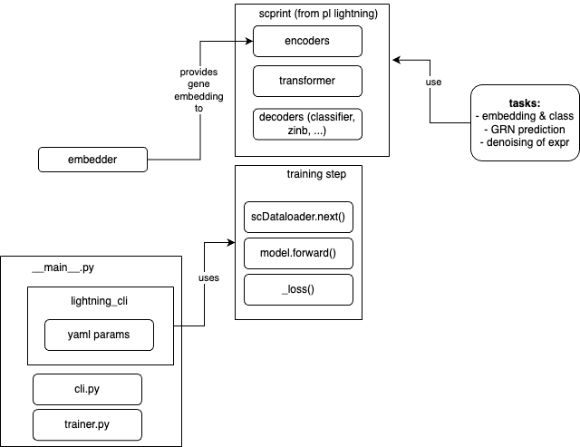

# structure

## gene embedders

Function to get embeddings from a set of genes, given their ensembl ids. For now use 2 different models:

- `RNABert`: for non coding genes
- `ESM2`: for protein coding genes

given ids, a fasta file, will use the models to compute an embedding of each gene.

This could be potentially applied to genes with mutations and from different species.

## data_loaders

From scDataloader. (see more in the available readmes and website https://jkobject.com/scDataLoader)

For now can work with either one to many AnnData's or a laminDB Collection of AnnDatas

allows you to preprocess your anndatas too.

They can be stored locally or remotely

stores them in a `Dataset` class.
Creates the DataLoaders from a `Datamodule` Class.
Collates the results using a `Collator` function.

## model

Extends from lightning data module to implement all the necessary functions to do:

- training
- validation
- testing
- prediction (inference)

is subdivided into multiple parts:

- encoder
- transformer
- decoder

## trainer & cli

the model uses lightning's training toolkit and CLI tools.

to use CLI, just call scprint ... (will call the `__main__.py` function).
Additional, training-specific informations are passed to the model using the trainer.py function.
specific training schemes are available under the `config` folder as `yaml` files.
Moreover the model can be trained on multiple compute types. SLURM scripts are available under the `slurm` folder.

## tasks

Implement different tasks that a pretrained model would perform. for now:

- GRN prediction: given a single cell dataset and a group (cell type, cluster, ...) will output a `GRnnData` completed with a predicted GRN from the attention of the model.
- denoising: from a single cell dataset, will modify the count matrices to predict what it would have looked like if it had been sequenced deeper, according to the model.
- embedding: from a single cell dataset, will create embeddings (low dimensional representations) of each cells, as well as prediction of the cell labels the model has been trained on (cell type, disease, ethnicity, sex...). It will also output a umap and predicted expression from the zinb, post bottleneck (similar to a VAE decoder prediction)